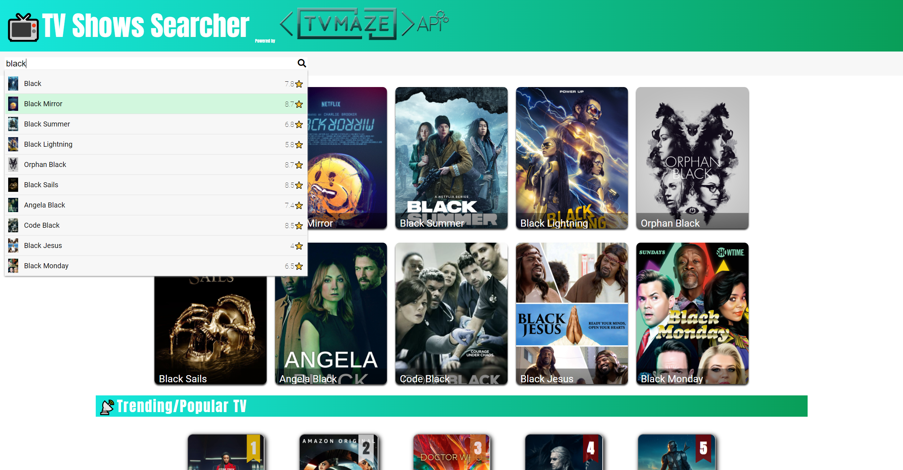

TV Show Searcher is an interactive, responsive and dynamic web app that allows users to easily navigate the site and get information about their TV shows. 

The is a single-page application that incorporates API calls to TVmaze for information.

## Links

- [Deployed Application](https://tv-show-searcher.herokuapp.com/)

# Application main page

# Application search autocompleter and results

# TV shows detailed information page

